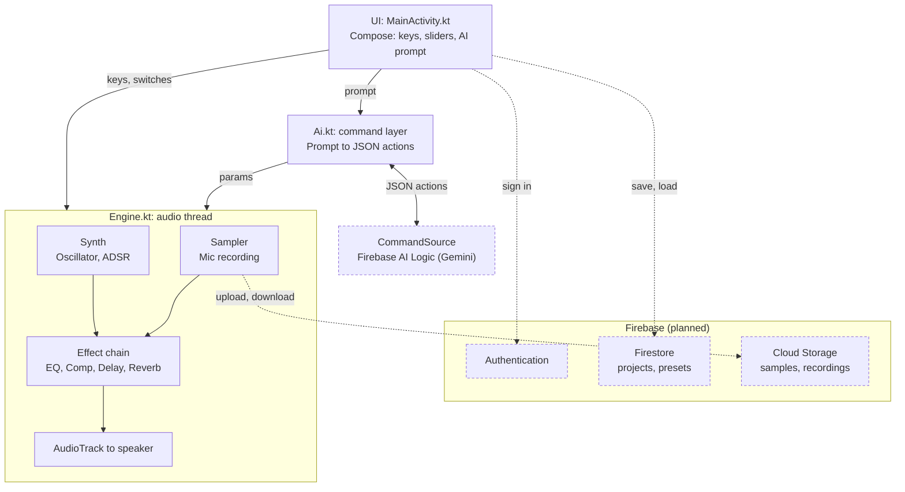

ver 0.1
# soundengitool

```mermaid
flowchart TB
    UI["UI: MainActivity.kt<br/>Compose: keys, sliders, AI prompt"]
    AI["Ai.kt: command layer<br/>Prompt to JSON actions"]
    SRC["CommandSource<br/>Firebase AI Logic (Gemini)"]

    subgraph FB["Firebase (planned)"]
        AUTH["Authentication"]
        FS["Firestore<br/>projects, presets"]
        ST["Cloud Storage<br/>samples, recordings"]
    end

    subgraph ENGINE["Engine.kt: audio thread"]
        SYNTH["Synth<br/>Oscillator, ADSR"]
        SAMPLER["Sampler<br/>Mic recording"]
        FX["Effect chain<br/>EQ, Comp, Delay, Reverb"]
        OUT["AudioTrack to speaker"]
        SYNTH --> FX
        SAMPLER --> FX
        FX --> OUT
    end

    UI -->|prompt| AI
    UI -->|keys, switches| ENGINE
    AI -->|params| ENGINE
    AI <-->|JSON actions| SRC
    UI -.->|sign in| AUTH
    UI -.->|save, load| FS
    SAMPLER -.->|upload, download| ST

    classDef planned stroke-dasharray: 4 3
    class SRC,AUTH,FS,ST planned
```
